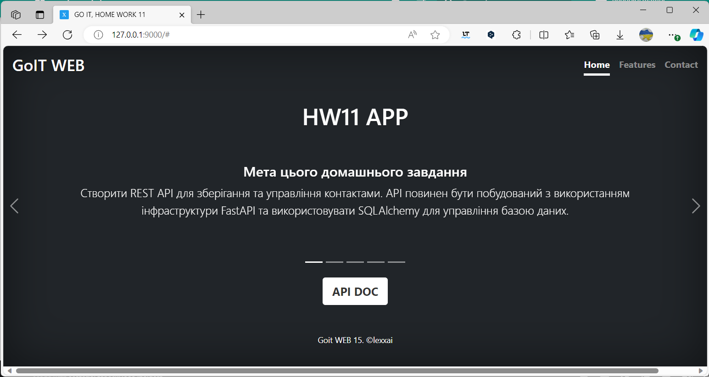
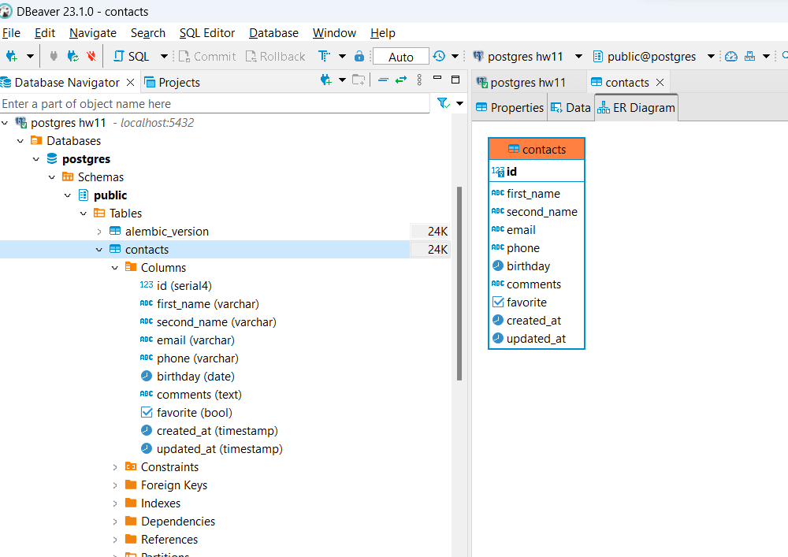
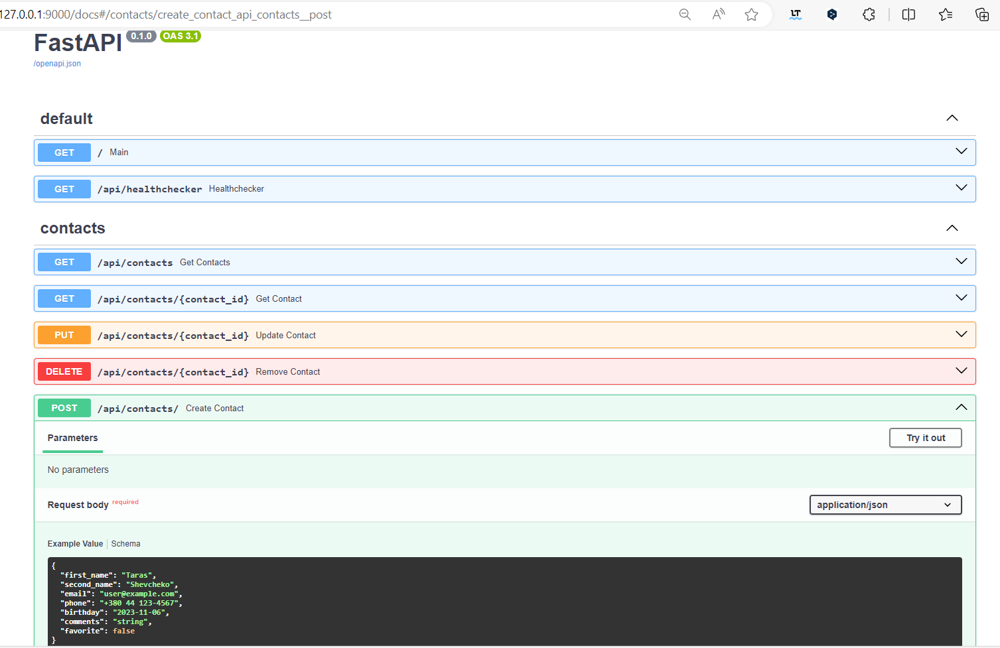
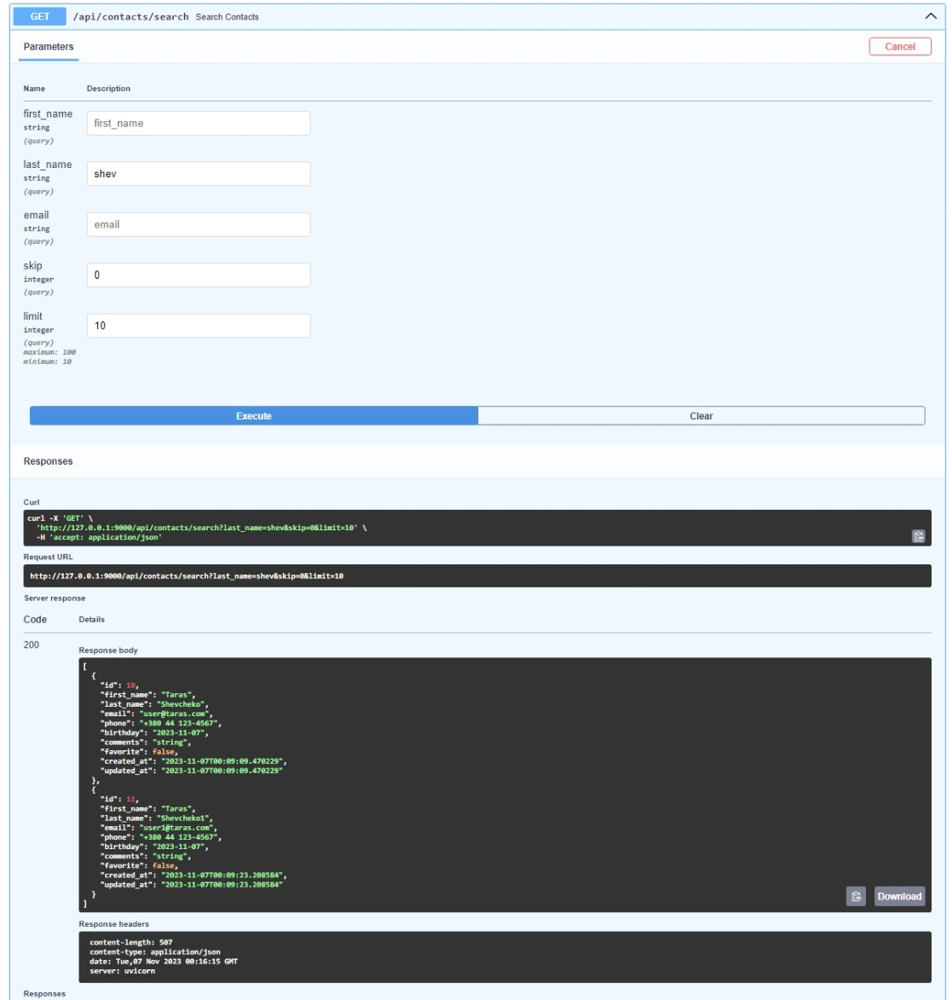
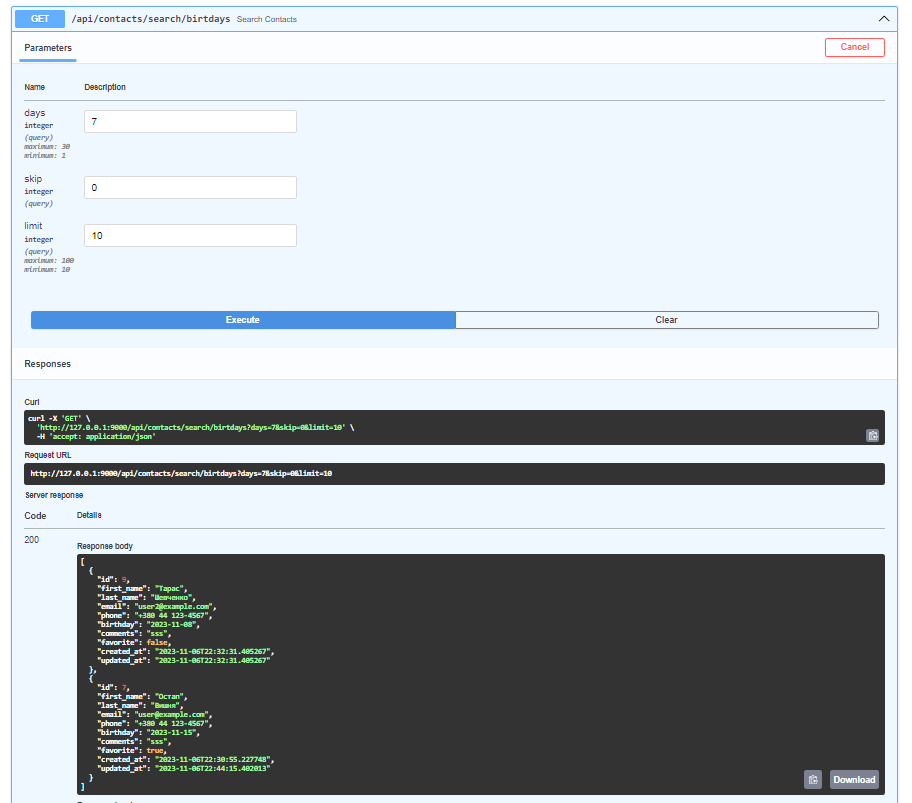

# goit_python_web_hw_11
#GoIT, #Python #WEB, Homework number 11. #FastAPI. #PostgreSQL. #Docker. #RESTAPI. #ORM #SQLAlchemy. #Pydantic. #Alembic.
# Домашнє завдання #11

## Мета цього домашнього завдання
Cтворити REST API для зберігання та управління контактами. API повинен бути побудований з використанням інфраструктури FastAPI та використовувати SQLAlchemy для управління базою даних.

### Контакти повинні зберігатися в базі даних та містити в собі наступну інформацію:

- Ім'я
- Прізвище
- Електронна адреса
- Номер телефону
- День народження
- Додаткові дані (необов'язково)

### API повинен мати можливість виконувати наступні дії:

- Створити новий контакт
- Отримати список всіх контактів
- Отримати один контакт за ідентифікатором
- Оновити існуючий контакт
- Видалити контакт

### На придачу до базового функціоналу CRUD API також повинен мати наступні функції:

- Контакти повинні бути доступні для пошуку за іменем, прізвищем чи адресою електронної пошти (Query).
- API повинен мати змогу отримати список контактів з днями народження на найближчі 7 днів.

### Загальні вимоги

1. Використання фреймворку FastAPI для створення API
1. Використання ORM SQLAlchemy для роботи з базою даних
1. В якості бази даних слід використовувати PostgreSQL.
1. Підтримка CRUD операцій для контактів
1. Підтримка зберігання дати народження контакту
1. Надання документів для API
1. Використання модуля перевірки достовірності даних Pydantic

## Виконання 

### Index Templated page

### PostgreSQL. model Contacts. ORM SQLAlchemy, Alembic

### FastAPI CRUD 

### BONUS:

####  Контакти повинні бути доступні для пошуку за іменем, прізвищем чи адресою електронної пошти (Query).

#### API повинен мати змогу отримати список контактів з днями народження на найближчі 7 днів.

